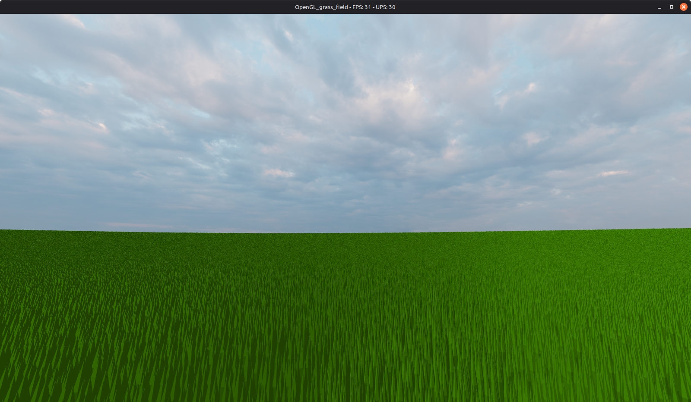
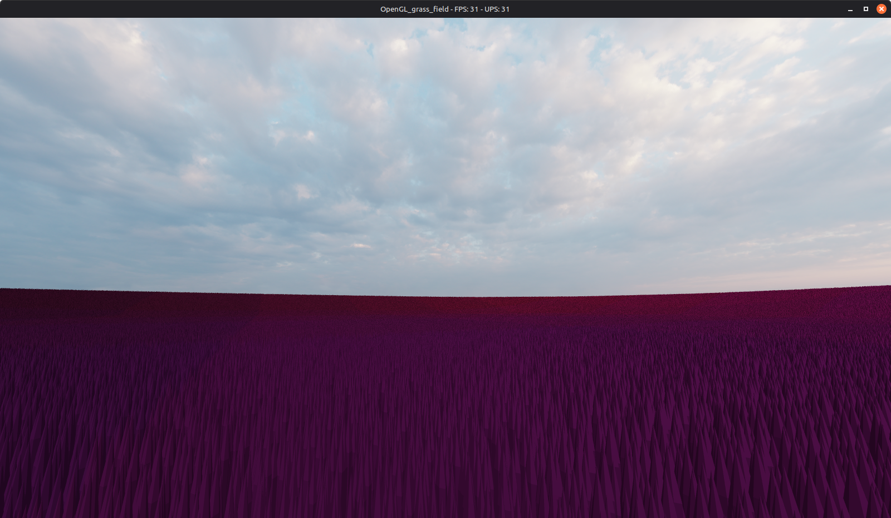

# OpenGL grass field

The goal of this project was to familiarize myself with instancing and, more broadly, with ways to increase performance. The project was written in C++ and OpenGL.

In order to increase performance:
- I created a material class that consisted of a shader and the bound uniform values. Scene objects that used the same material were drawn in batches in order to decrease shader changes.
- I used UBOs in order to reduce the amount of data that needs to be updated per frame.
- Apart from using OpenGL's instanced draw, I also split the instanced objects into chunks and only rendered those that were close enough.

In the end, I was able to render scenes that consisted of 5.7 million grass blades (each grass blade consisted of 74 vertices and 34 triangles) at 30 FPS.

 
